## Giới thiệu:
- Môn học: Lập trình WWW (Java)
- Chủ đề: Bài tập tuần 01
   

## Đề bài:
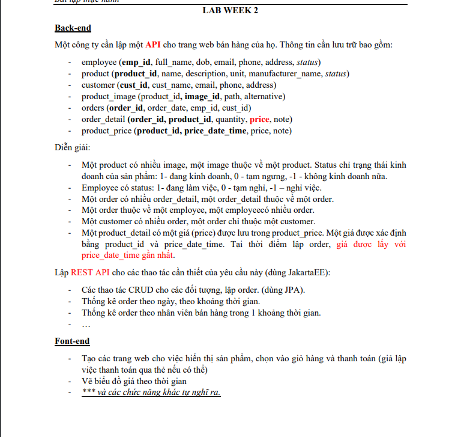
 

## Bài làm:
<b>1.Bán hàng</b>
- Hiển thị sản phẩm giá được lấy theo ngày gần nhất
  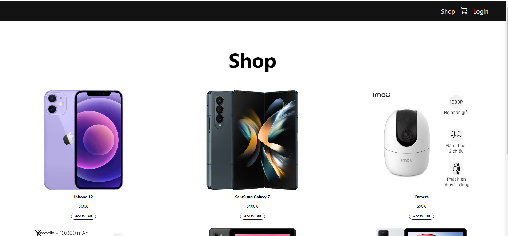
- Nhấn thêm sản phẩm vào giỏ hàng xong bấm vào giỏ hàng sẽ hiển thị những sản phẩm đã thêm vào giỏ hàng có thể tùy
chỉnh số lượng sản phẩm trong giỏ hàng
  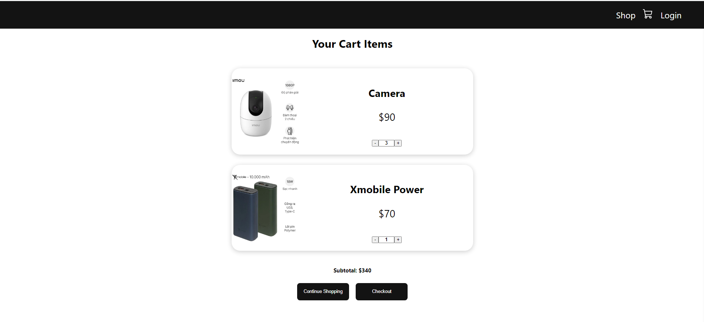
- Bấm checkout để chuyển tới giao diện thanh toán hoặc có thể chuyển về trang chủ để tiếp tục mua hàng
  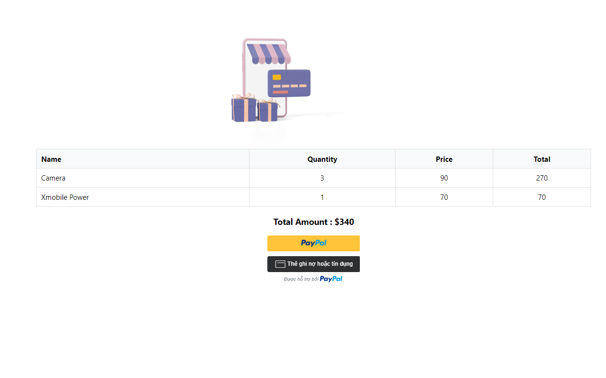
- Thanh toán bằng paypal hoặc thẻ ngân hàng 
- Đăng nhập tài khoản ngân hàng
  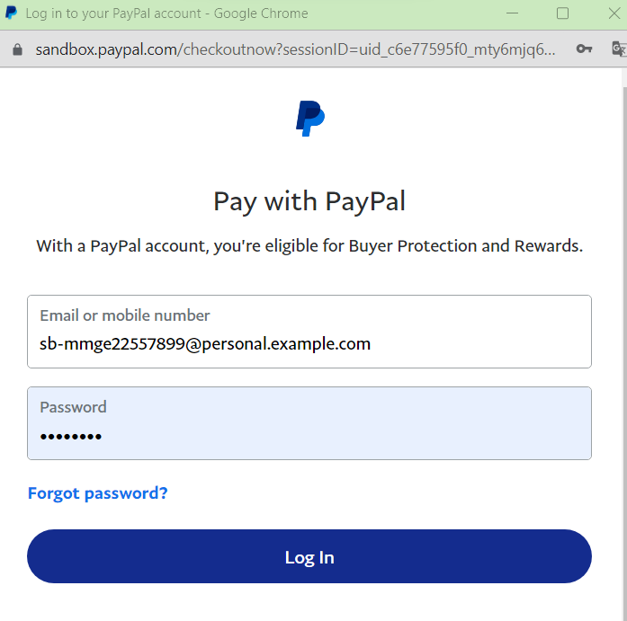
- Thanh toán thành công sẽ lưu order và chuyển về trang chủ
  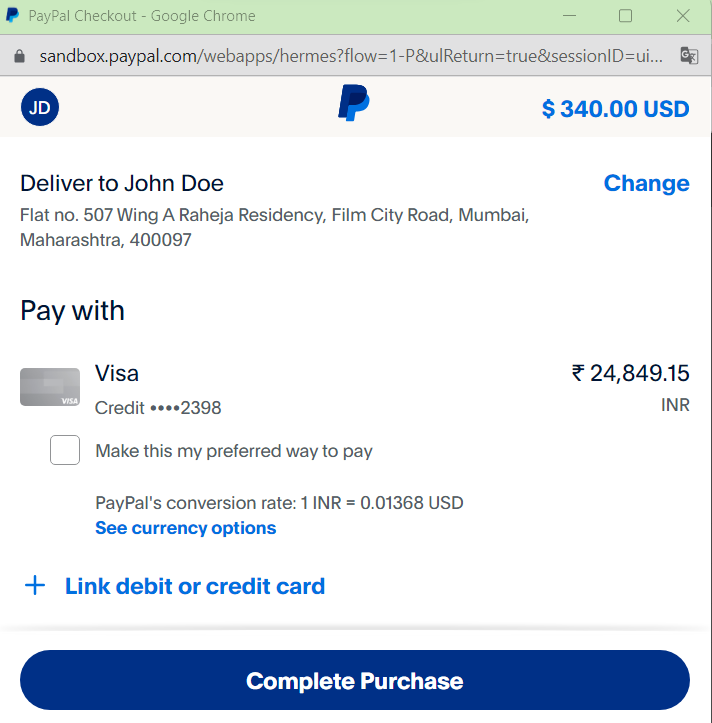
   
  <b>2.Quản lý sản phẩm</b>
- Danh sách sản phẩm
  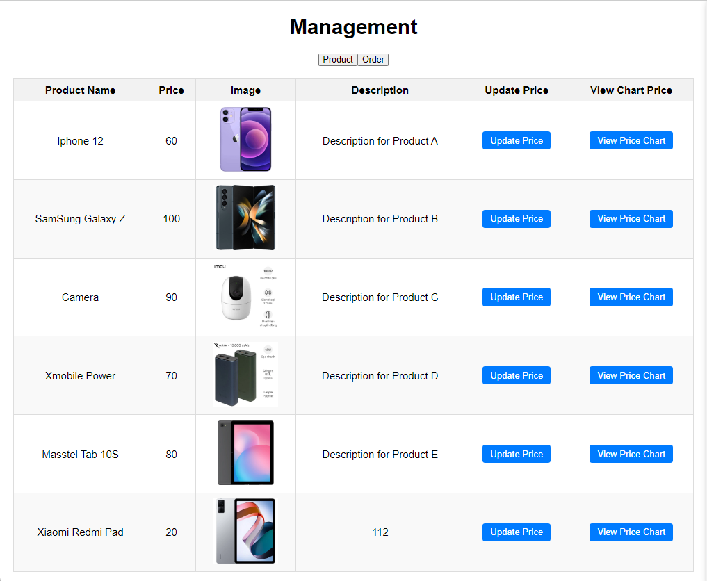
- Chức năng cập nhật giá của sản phẩm
- Trước khi cập nhật giá
  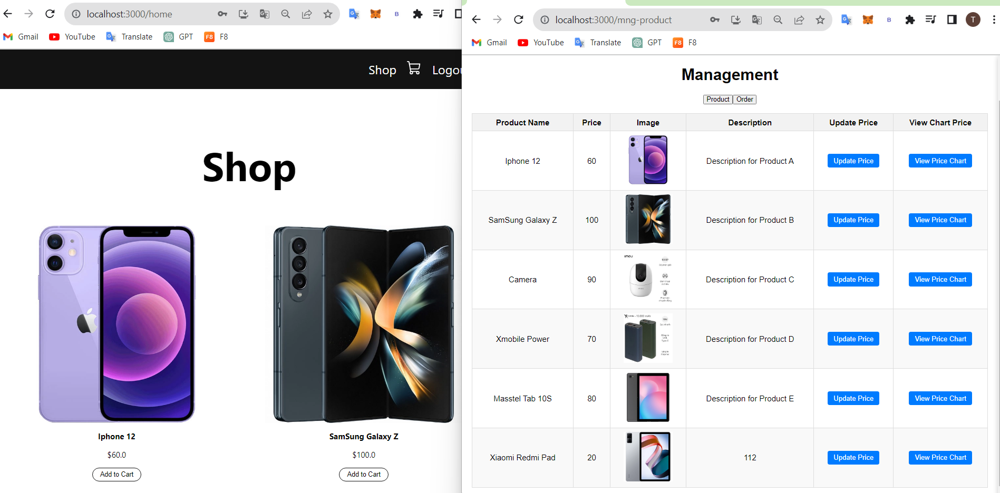
- Chọn 1 sản phẩm nhập giá mới và ghi chú rồi lưu
  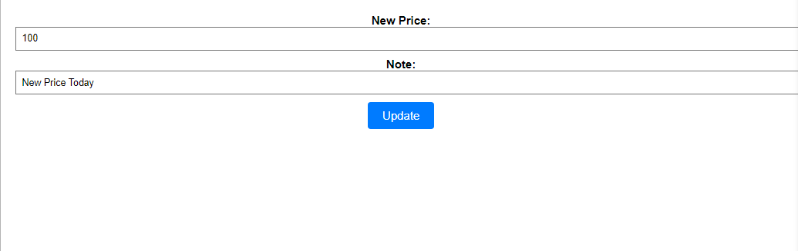
- Sử dụng web socket giá ở các trang khác cũng sẽ được cập nhật lập tức
  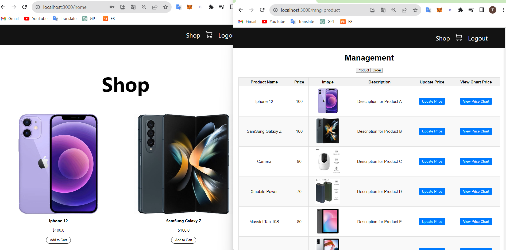
- Xem biểu đồ giá của 1 sản phẩm nào đó
  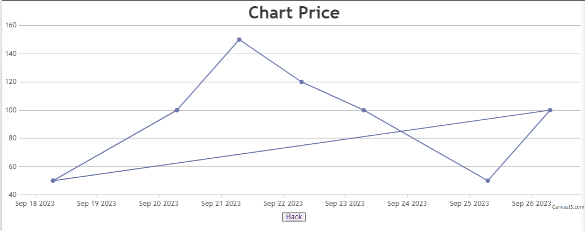
  <b>3.Thống kê order</b> 
- Thống kê theo ngày
  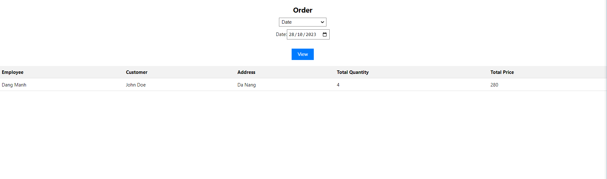
- Thống kê theo khoảng thời gian
  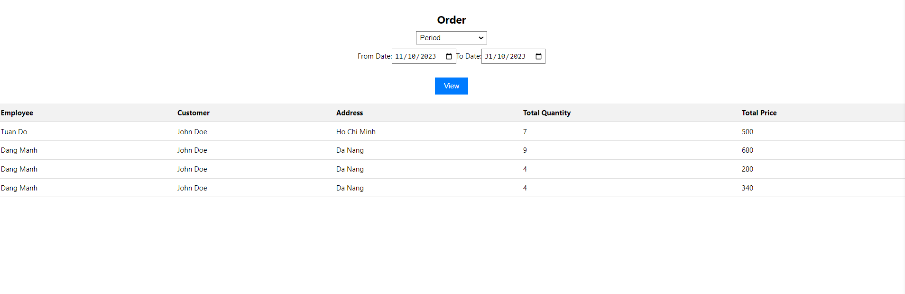
- Thông kê theo nhân viên bán trong 1 khoảng thời gian
  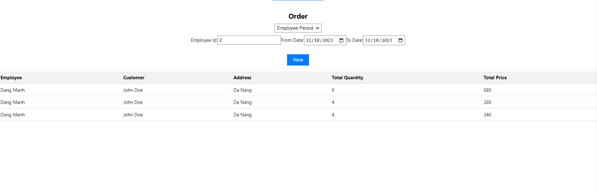
